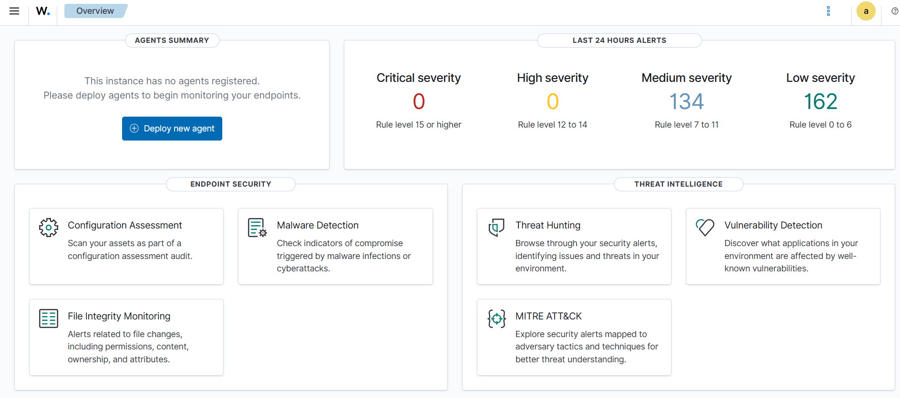

# Procédure d'installation

> ⚠️ Les commandes ci-dessous correspondent à Wazuh 4.x. Toujours vérifier la version courante sur la [documentation officielle](https://documentation.wazuh.com/current/installation-guide/index.html).

## 1. Préparation des VMs (VMware Workstation)

### Réseau

1. Chaque VM : carte 1 = NAT 

### VM wazuh-server (Ubuntu desktop 24.04)

- 8 Go RAM, 4 vCPU, 50 Go disque (provisionnement dynamique)
- IP statique : `192.168.154.153` (netplan)
- Snapshot `01-clean-os` après installation + `sudo apt update && sudo apt upgrade`

## 2. Installation du serveur Wazuh (all-in-one)

```bash
curl -sO https://packages.wazuh.com/4.x/wazuh-install.sh
sudo bash ./wazuh-install.sh -a
```

À la fin de l'installation :


- Noter les identifiants admin affichés → les stocker **hors du repo** (gestionnaire de mots de passe)
- Vérifier l'accès au dashboard : `https://192.168.154.153:443` depuis la machine hôte
- Vérifier les services :

```bash
sudo systemctl status wazuh-manager wazuh-indexer wazuh-dashboard
```

📸 *Capture à insérer : dashboard accessible, page d'accueil.*



Snapshot `02-wazuh-ready`.

## 3. Enrôlement de l'agent Linux

Sur la VM `agent-linux` (Ubuntu 24.04, IP `192.168.154.154`) :

```bash
sudo apt-get install -y gnupg apt-transport-https

curl -s https://packages.wazuh.com/key/GPG-KEY-WAZUH | sudo gpg --no-default-keyring --keyring gnupg-ring:/usr/share/keyrings/wazuh.gpg --import

sudo chmod 644 /usr/share/keyrings/wazuh.gpg

echo "deb [signed-by=/usr/share/keyrings/wazuh.gpg] https://packages.wazuh.com/4.x/apt/ stable main" | sudo tee /etc/apt/sources.list.d/wazuh.list

sudo apt-get update

sudo WAZUH_MANAGER="192.168.154.153" WAZUH_AGENT_NAME="agent-linux" apt-get install -y wazuh-agent

sudo systemctl daemon-reload
sudo systemctl enable wazuh-agent
sudo systemctl start wazuh-agent
sudo systemctl status wazuh-agent

```

Vérification côté manager :

```bash
sudo /var/ossec/bin/agent_control -l
```

L'agent doit apparaître avec le statut `Active`.

## 4. Enrôlement de l'agent Windows

Sur la VM `agent-windows` (Windows 11 pro, IP `192.168.154.155`), en PowerShell administrateur :

```powershell
Invoke-WebRequest -Uri "https://packages.wazuh.com/4.x/windows/wazuh-agent-4.14.6-1.msi" -OutFile "$env:USERPROFILE\Downloads\wazuh-agent-4.14.6-1.msi"

Get-ChildItem "$env:USERPROFILE\Downloads\wazuh-agent-4.14.6-1.msi"

msiexec.exe /i "$env:USERPROFILE\Downloads\wazuh-agent-4.14.6-1.msi" /l*v "$env:USERPROFILE\Downloads\install.log" WAZUH_MANAGER="192.168.154.153" WAZUH_AGENT_NAME="agent-windows"

Start-Service -Name "Wazuh"
Get-Service -Name "Wazuh"
```

### Bonus : installation de Sysmon (fortement recommandé)

Sysmon enrichit énormément les logs Windows (création de processus, connexions réseau, etc.) :

```powershell
Invoke-WebRequest -Uri "https://download.sysinternals.com/files/Sysmon.zip" -OutFile "$env:USERPROFILE\Downloads\Sysmon.zip"
Expand-Archive "$env:USERPROFILE\Downloads\Sysmon.zip" -DestinationPath "C:\Sysmon" -Force

Invoke-WebRequest -Uri "https://raw.githubusercontent.com/SwiftOnSecurity/sysmon-config/master/sysmonconfig-export.xml" -OutFile "C:\Sysmon\sysmonconfig.xml"

C:\Sysmon\Sysmon64.exe -accepteula -i C:\Sysmon\sysmonconfig.xml
Get-Service Sysmon64
Get-WinEvent -ListLog "Microsoft-Windows-Sysmon/Operational" | Select-Object LogName, RecordCount

```
Ajouter la collecte du canal Sysmon dans la config de l'agent (voir `config/agents/agent.conf`)

## 5. Déploiement des configurations du repo

1. Copier `config/manager/ossec.conf` vers `/var/ossec/etc/ossec.conf` (adapter si besoin)
2. Copier `rules/local_rules.xml` vers `/var/ossec/etc/rules/local_rules.xml`
3. Pousser la config centralisée des agents via `/var/ossec/etc/shared/default/agent.conf`
4. Redémarrer : `sudo systemctl restart wazuh-manager`

## 6. Vérifications finales

- [ ] Les 2 agents sont `Active` dans le dashboard
- [ ] Des événements remontent (Security Events)
- [ ] Le module Vulnerability Detection est activé
- [ ] Snapshot `02-wazuh-ready` pris sur les 3 VMs

## Dépannage courant

| Problème | Piste |
|---|---|
| Agent `Never connected` | Vérifier IP du manager dans la conf agent, pare-feu (1514-1515/TCP), réseau host-only |
| Dashboard inaccessible | `systemctl status wazuh-dashboard`, certificat auto-signé à accepter dans le navigateur |
| Indexer qui rame | Réduire la heap JVM à 2 Go dans `/etc/wazuh-indexer/jvm.options` |
| Install du dashboard échoue (disque plein) | Ubuntu n'alloue que ~50% du disque en LVM. Étendre : `sudo lvextend -l +100%FREE /dev/ubuntu-vg/ubuntu-lv && sudo resize2fs /dev/ubuntu-vg/ubuntu-lv`. Vérifier l'espace non alloué avec `sudo vgs` (colonne VFree) |
