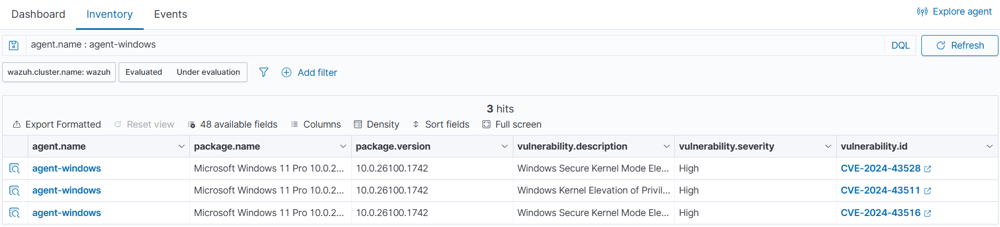
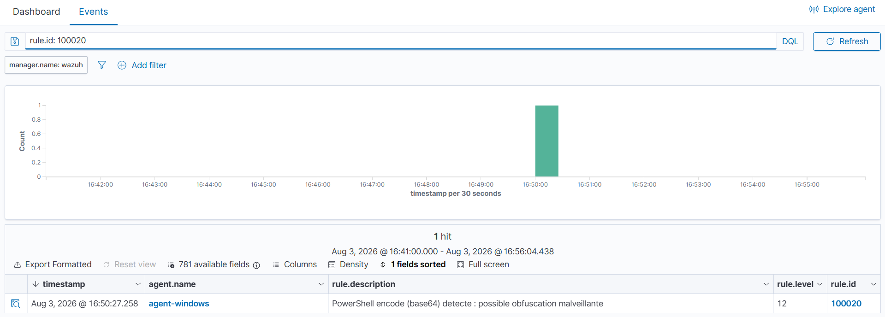
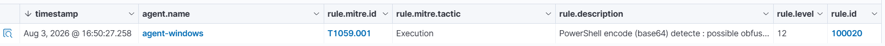
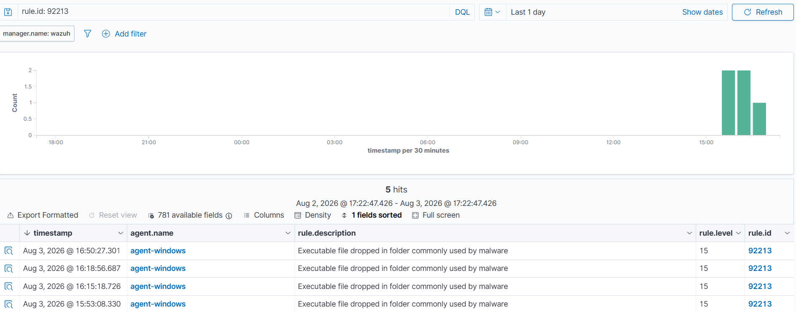

# Cas d'usage de détection

Chaque cas suit la même trame : **objectif → mise en place → simulation → résultat attendu → preuve**. Les captures d'alertes sont dans le dossier [`docs/img/`](img/).

---

## Cas d'usage n°1 — Brute force SSH + blocage automatique (Active Response)

### Objectif

Détecter une attaque par force brute SSH contre l'endpoint Linux **et** bloquer automatiquement l'adresse IP de l'attaquant, sans intervention humaine. C'est le cas d'usage le plus abouti du projet : il couvre à la fois la **détection** et la **réponse automatisée**, ce qui distingue un dispositif de sécurité actif d'une simple supervision.

**Technique MITRE ATT&CK :** T1110 — Brute Force

### Architecture du test

| Rôle | Machine | IP |
|---|---|---|
| Cible | VM agent-linux | 192.168.154.154 |
| Attaquant | Machine physique | 192.168.154.1 |
| SIEM | VM serveur Wazuh | (manager) |

Flux : la machine physique lance un brute force SSH → l'agent-linux journalise les échecs → Wazuh détecte le motif → l'active response bloque l'IP de l'attaquant sur l'agent.

### Règle de détection (custom)

Règle écrite pour le projet (`rules/local_rules.xml`) — se déclenche sur 6 échecs SSH en 120 secondes depuis une même IP source :

```xml
<rule id="100001" level="12" frequency="6" timeframe="120">
  <if_matched_sid>5710</if_matched_sid>
  <same_source_ip />
  <description>Brute force SSH probable : echecs repetes depuis $(srcip)</description>
  <mitre>
    <id>T1110</id>
  </mitre>
  <group>authentication_failures,</group>
</rule>
```

### Configuration de l'Active Response (serveur Wazuh)

Bloc `<active-response>` dans `/var/ossec/etc/ossec.conf`, associé à la règle 100001 :

```xml
<active-response>
  <command>firewall-drop</command>
  <location>local</location>
  <rules_id>100001</rules_id>
  <timeout>600</timeout>
</active-response>
```

- `firewall-drop` : script natif Wazuh qui ajoute une règle DROP via iptables
- `location: local` : le blocage s'exécute sur l'agent qui a généré l'alerte
- `timeout: 600` : l'IP est débloquée automatiquement après 10 minutes

### Simulation

Depuis la machine physique (PowerShell), 12 tentatives de connexion SSH avec des utilisateurs inexistants :

```powershell
for ($i=1; $i -le 12; $i++) {
  ssh -o StrictHostKeyChecking=no -o ConnectTimeout=3 -o PreferredAuthentications=password -o NumberOfPasswordPrompts=1 "attaquant$i@192.168.154.154" "exit" 2>$null
}
```


### Résultat obtenu

**Détection.** Plusieurs alertes remontées dans le dashboard :

| Champ | Valeur |
|---|---|
| rule.id | 100001 |
| rule.level | 12 |
| rule.description | Brute force SSH probable : echecs repetes depuis 192.168.154.1 |
| agent.name | agent-linux |

**Réponse automatique.** Vérification sur l'agent-linux — l'IP de l'attaquant est bloquée par iptables :

```bash
$ sudo iptables -L -n | grep 192.168.154.1
DROP       0    --  192.168.154.1        0.0.0.0/0
DROP       0    --  192.168.154.1        0.0.0.0/0
```

**Preuve du blocage effectif.** Pendant la fenêtre de 600 secondes, toute nouvelle connexion SSH depuis 192.168.154.1 vers l'agent est rejetée (timeout), alors qu'elle répondait immédiatement avant l'attaque.


### Chaîne complète détection → réponse

1. La machine physique lance un brute force SSH contre l'agent-linux
2. L'agent journalise les échecs d'authentification (`/var/log/auth.log`)
3. Wazuh détecte 6+ échecs en 120 s → la règle custom 100001 se déclenche (niveau 12)
4. L'active response `firewall-drop` s'exécute sur l'agent
5. iptables bloque l'IP source pour 600 secondes, puis la débloque automatiquement

### Enseignement

*Limites à noter :* un blocage par IP peut être contourné (rotation d'IP, botnet) et peut créer un risque de déni de service si un utilisateur légitime est bloqué à tort. En production, l'active response se combine avec d'autres mesures (clés SSH plutôt que mots de passe, restriction d'accès par IP, fail2ban, MFA).

---

## Cas d'usage n°2 — Surveillance d'intégrité de fichiers (FIM)

### Objectif

Détecter en temps réel toute création ou modification de fichiers dans les répertoires système sensibles de l'endpoint Linux, et lever une alerte prioritaire lorsqu'un fichier d'authentification critique (`/etc/passwd`, `/etc/shadow`, `/etc/sudoers`) est altéré — un signe classique de compromission (création de compte, escalade de privilèges).

**Techniques MITRE ATT&CK :** T1098 — Account Manipulation / T1565 — Data Manipulation

### Configuration

Le FIM est géré par le module **syscheck**, configuré via la config centralisée poussée depuis le serveur (`config/agents/agent.conf`) :

```xml
<syscheck>
  <disabled>no</disabled>
  <frequency>43200</frequency>
  <directories check_all="yes" realtime="yes">/etc</directories>
  <directories check_all="yes">/bin,/sbin,/usr/bin,/usr/sbin</directories>
  <ignore>/etc/mtab</ignore>
  <ignore>/etc/random-seed</ignore>
  <ignore type="sregex">.log$|.swp$</ignore>
</syscheck>
```

L'attribut `realtime="yes"` sur `/etc` active la surveillance instantanée (via inotify), au lieu des scans périodiques toutes les 12 h.

### Règle de détection (custom)

Règle écrite pour le projet (`rules/local_rules.xml`) — élève la sévérité sur les fichiers d'authentification critiques :

```xml
<rule id="100010" level="12">
  <if_group>syscheck</if_group>
  <match>/etc/passwd|/etc/shadow|/etc/sudoers</match>
  <description>Modification d'un fichier d'authentification critique</description>
  <mitre>
    <id>T1098</id>
  </mitre>
</rule>
```

### Simulation

Deux modifications déclenchées sur l'agent-linux :

```bash
# Création d'un fichier dans /etc (déclenche le FIM générique)
sudo touch /etc/test_fim_wazuh.txt

# Modification d'un fichier d'authentification critique (déclenche la règle 100010)
echo "# test wazuh fim" | sudo tee -a /etc/passwd
```

### Résultat obtenu — Deux niveaux de détection

Les deux alertes sont remontées **en quelques secondes** (confirmation du temps réel) :

| timestamp | rule.description | rule.level | rule.id |
|---|---|---|---|
| 20:16:10 | Modification d'un fichier d'authentification critique : /etc/passwd | 12 | **100010** (custom) |
| 20:15:37 | File added to the system | 5 | 554 (native) |

**Analyse.** Ce cas illustre une bonne pratique de détection en profondeur :
- La règle **native 554** (niveau 5) assure une surveillance large : tout fichier ajouté dans un répertoire surveillé est journalisé.
- La règle **custom 100010** (niveau 12) surenchérit sur les fichiers les plus sensibles : une modification de `/etc/passwd` remonte en priorité haute, car elle peut signaler une création de compte malveillant ou une élévation de privilèges.


### Nettoyage

```bash
sudo rm -f /etc/test_fim_wazuh.txt
sudo sed -i '/# test wazuh fim/d' /etc/passwd
```

La suppression de ces éléments génère elle-même de nouvelles alertes FIM (« File deleted », « File modified »), ce qui confirme une nouvelle fois le bon fonctionnement de la surveillance temps réel.

### Enseignement

*Piste d'approfondissement :* étendre le FIM à d'autres emplacements sensibles (`/root/.ssh/`, tâches cron, `/etc/cron.*`) et activer le module `whodata` (basé sur auditd) pour identifier **quel utilisateur et quel processus** ont modifié le fichier, pas seulement le fait qu'il ait changé.

---

## Cas d'usage n°3 — Détection de vulnérabilités (CVE)

### Objectif

Identifier automatiquement les vulnérabilités connues (CVE) affectant les logiciels et le système d'exploitation de l'endpoint Windows, afin de prioriser les actions de remédiation avant qu'elles ne soient exploitées.

Contrairement aux autres cas d'usage (détection réactive sur événements), ce module relève de la **gestion proactive du risque** : il s'agit d'identifier les failles présentes sur le parc, indépendamment de toute attaque en cours.

**Tactique MITRE ATT&CK ciblée :** TA0004 — Privilege Escalation / T1068 — Exploitation for Privilege Escalation

### Fonctionnement

1. Le module **Syscollector** de l'agent remonte l'inventaire de la machine (OS, build, logiciels installés, hotfixes).
2. Le manager télécharge périodiquement les **feeds de vulnérabilités** (NVD, feeds éditeurs).
3. Wazuh croise l'inventaire avec les feeds et génère la liste des CVE applicables.

### Configuration (serveur Wazuh)

Module activé dans `/var/ossec/etc/ossec.conf` :

```xml
<vulnerability-detection>
  <enabled>yes</enabled>
  <index-status>yes</index-status>
  <feed-update-interval>60m</feed-update-interval>
</vulnerability-detection>
```

Aucune configuration supplémentaire côté agent : Syscollector est actif par défaut.

### Résultat obtenu

Consultation via **Agents > agent-windows > Vulnerability Detection > Inventory**.

**Vulnérabilités actives détectées sur `agent-windows`** (Microsoft Windows 11 Pro, build `10.0.26100.1742`) :

| CVE | Description | Sévérité |
|---|---|---|
| CVE-2024-43528 | Windows Secure Kernel Mode Elevation of Privilege | High |
| CVE-2024-43511 | Windows Kernel Elevation of Privilege | High |
| CVE-2024-43516 | Windows Secure Kernel Mode Elevation of Privilege | High |

**Analyse.** Les trois vulnérabilités sont des failles d'**élévation de privilèges** dans le noyau Windows. Ce type de faille permet à un attaquant disposant déjà d'un accès limité sur la machine d'obtenir les privilèges SYSTEM, soit un contrôle total de l'hôte. Elles correspondent à l'étape classique post-intrusion d'une kill chain : après l'accès initial, l'attaquant cherche à escalader ses privilèges.

**Remédiation.** Ces CVE sont corrigées par les mises à jour cumulatives Microsoft. La remédiation consiste simplement à appliquer Windows Update — ce qui illustre la valeur du module : la correction est triviale, mais encore faut-il **savoir** que la machine est vulnérable.



### Historique et suivi d'état

L'onglet **Events** (filtre `rule.groups: vulnerability-detector`) a remonté **1 249 événements** sur 24 h, majoritairement au statut `Solved` : Wazuh journalise le passage d'une vulnérabilité de l'état actif à l'état corrigé.

Cette distinction est importante pour l'exploitation :

| Vue | Contenu | Usage |
|---|---|---|
| **Inventory** | État actuel consolidé des CVE de l'agent | Prioriser la remédiation |
| **Events** | Flux historique des changements d'état | Tracer l'évolution et prouver la remédiation |

Le filtre `data.vulnerability.status: "Active"` sur Events ne renvoyait aucun résultat, ce qui confirmait que l'historique récent ne contenait que des vulnérabilités déjà corrigées — d'où la nécessité de consulter Inventory pour l'état réel.

### Enseignement

Ce cas d'usage illustre deux points :

1. **La complémentarité détection / prévention.** Les cas 1, 2 et 4 détectent des attaques en cours ; celui-ci réduit la surface d'attaque en amont.
2. **L'importance de savoir où regarder.** Le flux d'événements et l'inventaire consolidé répondent à des questions différentes ; confondre les deux mène à conclure à tort qu'aucune vulnérabilité n'est présente.

*Piste d'approfondissement :* appliquer Windows Update sur la VM, puis relancer un scan pour observer le passage des trois CVE de `Active` à `Solved` — documentant ainsi un cycle complet détection → remédiation → vérification.

## Cas d'usage n°4 — Détection d'événements Windows suspects (Sysmon)

### Objectif

Détecter l'exécution d'une commande **PowerShell encodée en base64** sur l'endpoint Windows. L'encodage via le paramètre `-EncodedCommand` est une technique d'obfuscation couramment utilisée par les attaquants pour masquer leur code et échapper aux détections basiques.

**Technique MITRE ATT&CK :** T1059.001 — Command and Scripting Interpreter : PowerShell

### Prérequis

- Agent Wazuh installé sur l'endpoint Windows (`agent-windows`)
- **Sysmon** installé avec la configuration SwiftOnSecurity
- Collecte du canal `Microsoft-Windows-Sysmon/Operational` activée dans l'`ossec.conf` de l'agent
- Règle custom `100020` chargée sur le manager

### Règle de détection (custom)

Règle écrite spécifiquement pour ce projet (`rules/local_rules.xml`) :

```xml
<rule id="100020" level="12">
  <if_group>sysmon_event1</if_group>
  <field name="win.eventdata.commandLine" type="pcre2">(?i)-e(nc|ncodedcommand)?\s</field>
  <description>PowerShell encode (base64) detecte : possible obfuscation malveillante</description>
  <mitre>
    <id>T1059.001</id>
  </mitre>
</rule>
```

La règle se déclenche sur un événement Sysmon de création de processus (Event ID 1) dont la ligne de commande contient le motif `-EncodedCommand`.

### Simulation

Commande lancée sur la VM Windows (charge utile bénigne : affiche un simple message) :

```powershell
powershell.exe -EncodedCommand VwByAGkAdABlAC0ASABvAHMAdAAgACIASABlAGwAbABvAC4A...
```

### Résultat obtenu — Vrai positif

Alerte remontée dans le dashboard (Threat Hunting > Events) :

| Champ | Valeur |
|---|---|
| rule.id | 100020 |
| rule.level | 12 |
| rule.description | PowerShell encode (base64) detecte : possible obfuscation malveillante |
| agent.name | agent-windows |
| timestamp | 2026-08-03 16:50:27 |

**Chaîne de détection validée :** Sysmon capture la création du processus (Event ID 1) → l'agent Wazuh transmet l'événement au manager → le manager applique la règle custom 100020 → l'alerte s'affiche dans le dashboard.




### Analyse d'un faux positif rencontré

Au cours des tests, une alerte de **niveau 15** (sévérité maximale) est apparue sur `agent-windows` :


| Champ | Valeur |
|---|---|
| rule.id | 92213 |
| rule.level | 15 |
| rule.description | Executable file dropped in folder commonly used by malware |
| data.win.eventdata.targetFilename | `C:\Users\djo\AppData\Local\Temp\__PSScriptPolicyTest_*.ps1` |

**Investigation.** Le fichier `__PSScriptPolicyTest_*.ps1` est généré **automatiquement par PowerShell** à chaque exécution de script : il sert à tester l'Execution Policy, puis est supprimé. Le processus créateur est `powershell.exe`. Le préfixe `__PSScriptPolicyTest_` est une signature connue de ce comportement interne légitime de Windows.

**Conclusion :** faux positif. La règle 92213 s'est déclenchée mécaniquement (fichier à extension `.ps1` déposé dans `AppData\Local\Temp`, un dossier surveillé), mais le contexte confirme une activité bénigne.

### Enseignement

Ce cas illustre une compétence clé de l'analyse SOC : **le niveau de sévérité ne suffit pas à qualifier une menace**. Le faux positif était en niveau 15 (théoriquement critique) alors que la vraie détection volontaire n'était qu'en niveau 12. Seule l'investigation du contexte (fichier, processus créateur, utilisateur) permet de distinguer le bruit légitime d'une menace réelle.

*Piste de tuning :* une règle custom pourrait abaisser le niveau des événements `__PSScriptPolicyTest_*` à 0 pour réduire ce bruit dans le dashboard.

---

## Cas d'usage n°5 — Audit de conformité (SCA / CIS Benchmark)

### Objectif

Évaluer la posture de sécurité de l'endpoint Linux en confrontant sa configuration réelle à un référentiel de durcissement reconnu : le **CIS Benchmark**. Contrairement aux cas 1 à 4 (détection d'actions malveillantes), le SCA relève de la **sécurité préventive** : il identifie les faiblesses de configuration *avant* qu'elles ne soient exploitées.

**Cadre :** hardening (durcissement système) et conformité (utile pour des référentiels comme PCI-DSS, ISO 27001).

### Fonctionnement

Le module **SCA (Security Configuration Assessment)** exécute une politique composée de centaines de contrôles issus des CIS Benchmarks. Chaque contrôle vérifie un point de configuration précis (permissions de fichiers, options SSH, présence d'un pare-feu, politique de mots de passe...) et renvoie un verdict : **Passed**, **Failed** ou **Not applicable**. Un score de conformité global en est déduit.

### Configuration

Module activé dans la config centralisée (`config/agents/agent.conf`) :

```xml
<sca>
  <enabled>yes</enabled>
</sca>
```

Les fichiers de politiques CIS sont fournis avec Wazuh et poussés automatiquement vers les agents. Aucune installation supplémentaire n'est nécessaire ; le scan s'exécute automatiquement.

### Résultat obtenu

Consultation via **Agents > agent-linux > Configuration Assessment**.

**Politique évaluée :** CIS Ubuntu Linux 24.04 LTS Benchmark v1.0.0

| Indicateur | Valeur |
|---|---|
| Contrôles évalués | 279 |
| Passed (conformes) | 98 |
| Failed (non conformes) | 147 |
| Not applicable | 34 |
| **Score de conformité** | **40 %** |
| Date du scan | 2026-08-03 20:09 |


### Analyse

Un score de 40 % sur une installation Ubuntu standard est **normal et attendu** : une distribution par défaut n'est pas durcie, alors que le CIS Benchmark représente un niveau d'exigence élevé, conçu pour des environnements sensibles.

Le point important est le sens de la mesure : le SCA ne juge pas la machine « mal configurée » dans l'absolu, il quantifie **l'écart entre la configuration actuelle et un standard de sécurité reconnu**. Les 147 contrôles en échec constituent une **feuille de route de durcissement** priorisable.

**Exemples de contrôles typiquement en échec sur un système non durci :**
- Connexion SSH root autorisée / authentification par mot de passe active
- Pare-feu (ufw / nftables) non configuré
- Absence de politique de complexité et d'expiration des mots de passe
- Modules noyau inutiles non désactivés
- Permissions trop permissives sur des fichiers sensibles

Chaque contrôle échoué est accompagné, dans le dashboard, de sa justification (rationale) et de sa procédure de remédiation.

### Enseignement

Ce cas illustre une facette de la cybersécurité complémentaire à la détection : l'évaluation de la **posture de sécurité**, c'est-à-dire la robustesse intrinsèque de la configuration. Là où les cas précédents répondent à « suis-je attaqué ? », le SCA répond à « suis-je correctement durci ? ». Les deux approches sont indispensables : détecter les attaques ne dispense pas de réduire la surface d'attaque en amont.

---

## Récapitulatif MITRE ATT&CK couvert

| Tactique | Technique | Cas |
|---|---|---|
| Credential Access | T1110 Brute Force | 1 |
| Persistence | T1098 Account Manipulation | 2 |
| Privilege Escalation | T1068 Exploitation for Privilege Escalation | 3 |
| Execution | T1059.001 PowerShell | 4 |

> Le cas d'usage n°5 (SCA / CIS Benchmark) évalue une posture de durcissement et ne correspond pas à une technique d'attaque MITRE ATT&CK ; il relève plutôt de référentiels de conformité (CIS Controls, PCI-DSS, ISO 27001).
